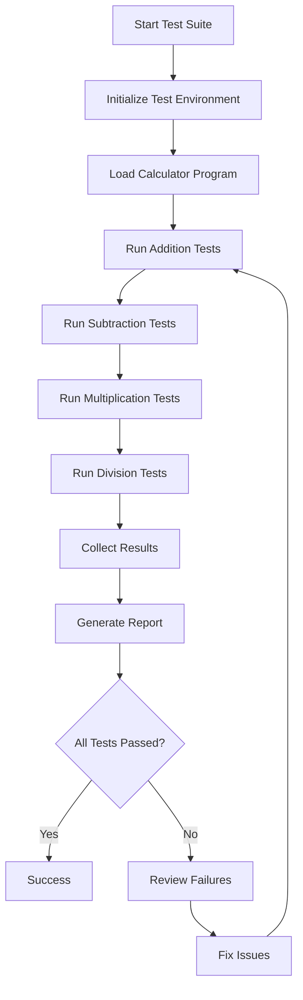

# COBOL Calculator Program - Unit Testing Plan

## Project Overview
This plan outlines the development of a COBOL calculator program with comprehensive unit test cases using a modern COBOL unit testing framework.

## 1. Project Structure

```
cobol-calculator/
├── src/
│   └── CALCULATOR.cbl          # Main calculator program
├── tests/
│   ├── test-addition.cbl       # Addition operation tests
│   ├── test-subtraction.cbl    # Subtraction operation tests
│   ├── test-multiplication.cbl # Multiplication operation tests
│   ├── test-division.cbl       # Division operation tests
│   └── test-runner.cbl         # Main test suite runner
├── test-data/
│   ├── normal-cases.txt        # Standard test scenarios
│   └── edge-cases.txt          # Boundary and error conditions
├── config/
│   └── test-config.conf        # Test framework configuration
└── docs/
    ├── test-results.md         # Test execution results
    └── coverage-report.md      # Code coverage analysis
```

## 2. Calculator Program Specifications

### Operations Supported
- **Addition**: Add two numbers
- **Subtraction**: Subtract second number from first
- **Multiplication**: Multiply two numbers
- **Division**: Divide first number by second (with zero-check)

### Input Format
- Two numeric operands (support for integers and decimals)
- Operation code (A=Add, S=Subtract, M=Multiply, D=Divide)

### Output Format
- Result of calculation
- Status code (SUCCESS, ERROR, DIVIDE-BY-ZERO)
- Error message (if applicable)

### Error Handling
- Division by zero detection
- Numeric overflow detection
- Invalid operation code handling
- Non-numeric input validation

## 3. Unit Testing Framework Selection

### Recommended: GnuCOBOL with COBOL-Unit-Test Framework

**Rationale:**
- Open-source and widely available
- Good documentation and community support
- Supports modern testing practices
- Easy integration with CI/CD pipelines

**Alternative:** IBM zUnit (for mainframe environments)

## 4. Test Case Categories

### 4.1 Normal Operation Tests
Test standard calculations with typical inputs:
- Positive integers
- Decimal numbers
- Zero as operand
- Small and medium-sized numbers

### 4.2 Edge Case Tests
Test boundary conditions:
- Very large numbers (near maximum)
- Very small numbers (near zero)
- Negative numbers
- Maximum precision decimals

### 4.3 Error Condition Tests
Test error handling:
- Division by zero
- Invalid operation codes
- Non-numeric inputs
- Overflow conditions

### 4.4 Performance Tests
- Response time for calculations
- Memory usage validation

## 5. Test Case Design

### Addition Tests
```
Test ID: ADD-001
Input: 5 + 3
Expected: 8, Status=SUCCESS

Test ID: ADD-002
Input: -5 + 3
Expected: -2, Status=SUCCESS

Test ID: ADD-003
Input: 999999 + 1
Expected: 1000000, Status=SUCCESS

Test ID: ADD-004
Input: 0.5 + 0.5
Expected: 1.0, Status=SUCCESS
```

### Subtraction Tests
```
Test ID: SUB-001
Input: 10 - 3
Expected: 7, Status=SUCCESS

Test ID: SUB-002
Input: 3 - 10
Expected: -7, Status=SUCCESS

Test ID: SUB-003
Input: 0 - 5
Expected: -5, Status=SUCCESS
```

### Multiplication Tests
```
Test ID: MUL-001
Input: 5 * 3
Expected: 15, Status=SUCCESS

Test ID: MUL-002
Input: -5 * 3
Expected: -15, Status=SUCCESS

Test ID: MUL-003
Input: 0 * 100
Expected: 0, Status=SUCCESS

Test ID: MUL-004
Input: 0.5 * 2
Expected: 1.0, Status=SUCCESS
```

### Division Tests
```
Test ID: DIV-001
Input: 10 / 2
Expected: 5, Status=SUCCESS

Test ID: DIV-002
Input: 10 / 3
Expected: 3.333..., Status=SUCCESS

Test ID: DIV-003
Input: 10 / 0
Expected: ERROR, Status=DIVIDE-BY-ZERO

Test ID: DIV-004
Input: 0 / 5
Expected: 0, Status=SUCCESS

Test ID: DIV-005
Input: -10 / 2
Expected: -5, Status=SUCCESS
```

## 6. Test Implementation Strategy

### Phase 1: Setup
1. Install GnuCOBOL compiler
2. Set up COBOL-Unit-Test framework
3. Create project directory structure
4. Configure test environment

### Phase 2: Development
1. Implement calculator program with modular design
2. Create separate paragraphs for each operation
3. Implement error handling routines
4. Add logging and status reporting

### Phase 3: Test Creation
1. Write test cases for each operation
2. Create test data files
3. Implement test assertions
4. Set up test runner

### Phase 4: Execution & Reporting
1. Run all test suites
2. Generate coverage reports
3. Document results
4. Identify and fix failures

## 7. Test Execution Workflow



## 8. Success Criteria

- **Code Coverage**: Minimum 90% of calculator code covered by tests
- **Test Pass Rate**: 100% of tests must pass
- **Error Handling**: All error conditions properly tested
- **Documentation**: Complete test documentation and results
- **Maintainability**: Tests are easy to understand and modify

## 9. Test Metrics to Track

- Total number of test cases
- Number of passed/failed tests
- Code coverage percentage
- Execution time per test
- Defects found and fixed
- Test maintenance effort

## 10. Continuous Integration

### Recommended CI/CD Integration
- Automated test execution on code commits
- Test result notifications
- Coverage trend tracking
- Regression test suite

## 11. Documentation Deliverables

1. **Test Plan** (this document)
2. **Test Cases Specification**
3. **Test Execution Results**
4. **Code Coverage Report**
5. **User Guide** for running tests
6. **Maintenance Guide** for updating tests

## 12. Next Steps

After plan approval:
1. Switch to Code mode to implement the calculator program
2. Create unit test cases using the framework
3. Execute tests and generate reports
4. Review results and iterate as needed

---

**Note**: This plan uses GnuCOBOL as the default compiler. If you're working in a mainframe environment with IBM Enterprise COBOL, the approach will be similar but may use zUnit instead.